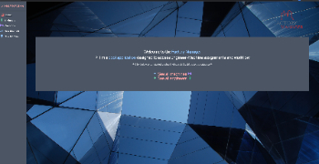

# FactoryManager.Solution
#### Created By: Connor Burgess 
* * *

## Description  
Project is designed for factory managers to easily access engineer-machine service assignments and workflow. Project is created in a dark mode theme and mostly styled using Tailwind utility classes & Boxicons. Utilizes .Net Core 5.0 and follows RESTful practices. Relational data is manipulated using ORM through Entity Framework Core in order to abstract and simplify SQL interaction. 
* * *

## Technologies used
* C#
* .Net v5.0
* ASP.net Core MVC
* Entity Framework Core
* Tailwind
* PostCSS
* Boxicons
* MySQL
* MySQL Workbench
* RESTful Routing
* * *

## User Stories
* As the factory manager, I need to be able to see a list of all engineers, and I need to be able to see a list of all machines.
As the factory manager, I need to be able to select a engineer, see their details, and see a list of all machines that engineer is licensed to repair. I also need to be able to select a machine, see its details, and see a list of all engineers licensed to repair it.
* As the factory manager, I need to add new engineers to our system when they are hired. I also need to add new machines to our system when they are installed.
* As the factory manager, I should be able to add new machines even if no engineers are employed. I should also be able to add new engineers even if no machines are installed
* As the factory manager, I need to be able to add or remove machines that a specific engineer is licensed to repair. I also need to be able to modify this relationship from the other side, and add or remove engineers from a specific machine.
I should be able to navigate to a splash page that lists all engineers and machines. Users should be able to click on an individual engineer or machine to see all the engineers/machines that belong to it.

* * *
## Setup 1) Initial Setup
* Ensure .Net v5.0 Core is installed: [download here](https://dotnet.microsoft.com/download/dotnet/5.0)
* Ensure dotnet script is installed: [instructions here](https://github.com/filipw/dotnet-script)
* Clone Repo from GitHub (Link: https://github.com/ConnorBurgess/FactoryManager.Solution.git)

## Setup 2) Initial Database Setup
* Ensure MySQL is installed [download here](https://www.mysql.com/)
* Ensure MySQL Workbench is installed [download here](https://www.mysql.com/products/workbench/)

## Setup 3) Install Tailwind
* Navigate to ./FactoryManager.Solution/Factory and type $"npm install" (no bling / quotes) in terminal in order to install dependencies.
* Navigate to ./FactoryManager.Solution/Factorymanager and type $"npx tailwind build ./wwwroot/css/site.css -o ./wwwroot/css/output.css" (no bling / quotes) in terminal in order to build CSS.

## Setup 4) Create appsettings.json
* Navigate to ./FactoryManager.Solution/Factory and create a file named "appsettings.json"
* Copy and paste the following into the file:
{
  "ConnectionStrings": {
    "DefaultConnection": "Server=localhost;Port=3306;database=connor_burgess;uid={YOUR UID};pwd={YOUR PWD;"
  }
}
* Input your UID and password from MYSQL database setup and remove curly braces from around pwd/UID. Please note your port may be different.
* If planning to push a project to GitHub, it is advised to avoid revealing sensitive details by [setting up a .gitignore](https://docs.github.com/en/github/using-git/ignoring-files) and ignoring this file.

## Setup 5) Dotnet Setup & Running Program
* Navigate to ./FactoryManager.Solution/Factory inside of the cloned repo and type $"dotnet restore" (no bling / quotes) in terminal
* * From inside ./FactoryManager.Solution/Factory folder type $"dotnet ef database update" (no bling / quotes) in terminal in order to connect migrations to MYSql
* You may utilize MySQL Workbench in order to verify database files if desired. [Check out the MySQL docs](https://dev.mysql.com/doc/workbench/en/wb-sql-editor-navigator.html)
* Run program by inputting$"dotnet run" (no bling / quotes) in terminal while in ./FactoryManager.Solution/Factory folder.

* * *

## To Do:

## Resources Used:
* Sidebar Navigation - https://tailwindcomponents.com/component/sidebar-navigation
* Sign up form - https://tailwindcomponents.com/component/sign-up-form-1
## Additional comments:
* Created on 3/19/21  
* * *

## License:
> *&copy; Connor Burgess, 2021*

Licensed under [MIT license](https://mit-license.org/)

* * *

## Contact Information
_Connor Burgess: [Email](connorburgesscodes@gmail.com)_
